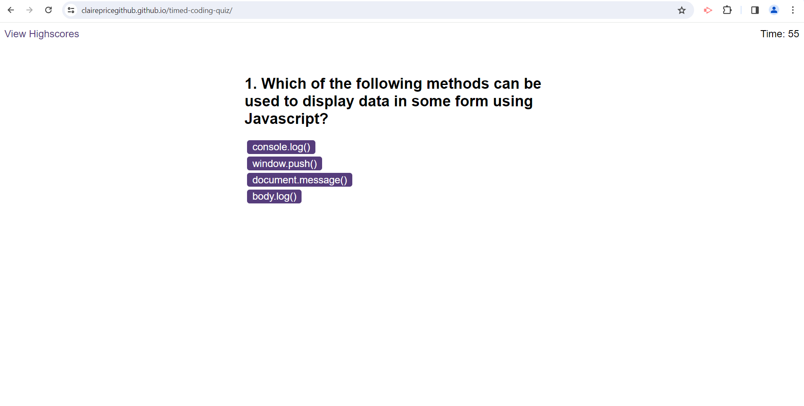

# Timed Coding Quiz

## Description
Project to create a timed coding quiz on the subject of JavaScript, to become familiar with typical coding assessments which can be part of a Front-End Web Developer interview process. These questions can be practised to prepare for such interview. The project also allowed me to practise undertaking an interactive coding challenge.

In this project HTML and CSS code is dynamically updated and powered by JavaScript. HTML and CSS starter code was provided and I created three JavaScript files, organising functionality of the quiz. 

During this project I improved my knowledge of using web API’s and functions, although I also became aware of areas where more study is needed so I can understand various techniques and perfect my code.

## Installation

N/A

## Usage

Open in the browser and click the 'Start Quiz' button to start the quiz. Select one of the four multiple choice answers in buttons to each question. The result is then displayed before automatically moving to the next question. An alert is shown on screen if the time runs out and the quiz restarts. On completion, the final score is displayed and initials can be inputted to add to high scores which are viewed on the link to 'View Highscores'.

https://clairepricegithub.github.io/timed-coding-quiz/

## Credits

BYBY. (2023, Aug 3). *How to wait n seconds in JavaScript*. https://byby.dev/js-wait-n-seconds.

Interview Bit. (2023, Nov 21). *JavaScript MCQ With Answers*. https://www.interviewbit.com/javascript-mcq/#which-of-the-following-is-not-a-javascript-framework.

Ofoegbu, J. (2023, Oct 13). *Let’s Build a Multiple Choice Quiz App With JavaScript*. Envato Tuts+. https://webdesign.tutsplus.com/multiple-choice-quiz-app-with-javascript--cms-107756t. 

Olawanle, J. (2023, Apr 14). *JavaScript Refresh Page – How to Reload a Page in JS*. Free Code Camp. https://www.freecodecamp.org/news/javascript-refresh-page-how-to-reload-a-page-in-js/.

## License

Please refer to the LICENSE in the repo
